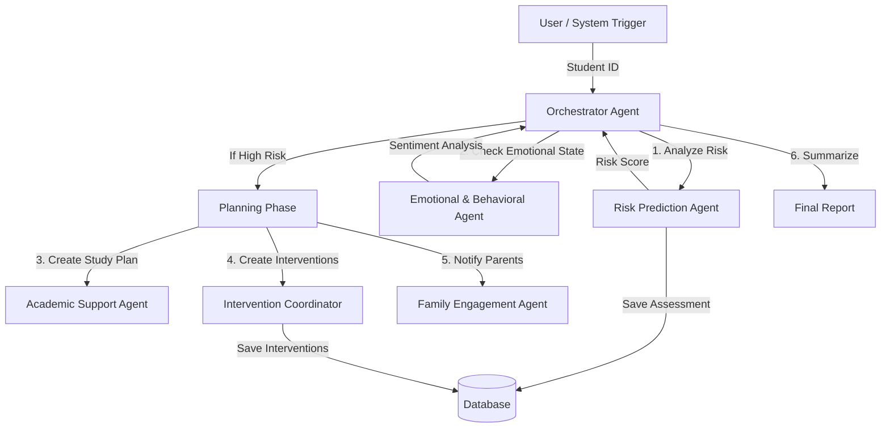

# School Dropout Prevention Multi-Agent System

## 1. The School Dropout Scenario (Problem Statement)
School dropout remains a critical issue in education systems worldwide, leading to reduced economic opportunities for individuals and significant societal costs. The primary challenge lies in **early detection**. Often, the signs of a student struggling—whether academic, emotional, or financial—appear in siloed systems (LMS, SIS, counseling logs) long before the student actually drops out. Human counselors are often overwhelmed by caseloads and cannot manually synthesize this disparate data for every student in real-time. By the time a student is flagged, it is often too late for effective intervention.

## 2. How Agents Can Help (Solution)
A Multi-Agent System (MAS) offers a powerful solution to this problem by mimicking a team of specialized experts working together 24/7.
*   **Holistic Analysis**: Unlike simple rule-based alerts, agents can synthesize unstructured data (counseling notes, survey sentiment) with structured data (grades, attendance).
*   **Specialization**: Different agents can adopt specific personas (e.g., a "Psychologist" agent vs. a "Financial Aid" agent), allowing for deep, nuanced analysis of specific risk factors.
*   **Scalability**: Agents can monitor thousands of students simultaneously, flagging only those who need human attention.
*   **Coordination**: An orchestrator agent can manage the workflow, ensuring that finding a risk leads to concrete actions (interventions, notifications) without human administrative overhead.

## 3. The School Dropout Multi-Agent System (Architecture)
This project implements a sophisticated multi-agent system using the **Google Agent Development Kit (ADK)**. It follows **Clean Architecture** principles to ensure modularity and testability.

### Architecture Diagram


### Agent Roles & Functionality
The system is composed of an **Orchestrator** and six specialized **Sub-Agents**.

1.  **Dropout Prevention Orchestrator** (`orchestrator/agent.py`):
    *   **Role**: The team lead. It coordinates the entire workflow.
    *   **Functionality**: It receives a student ID, delegates tasks to sub-agents, and synthesizes the final report. It uses a **Wrapper Pattern** to ensure each sub-agent runs in its own reliable execution context.

2.  **Risk Prediction Agent** (`risk_prediction/agent.py`):
    *   **Role**: The data analyst.
    *   **Functionality**: Fetches attendance, grades, LMS activity, and financial status. It calculates a risk score (0-1) and identifies key risk factors.
    *   **Persistence**: Automatically saves risk assessments to the database.

3.  **Emotional & Behavioral Agent** (`emotional/agent.py`):
    *   **Role**: The school psychologist.
    *   **Functionality**: Analyzes sentiment in counseling notes and student surveys to detect stress, disengagement, or behavioral issues.

4.  **Academic Support Agent** (`academic_support/agent.py`):
    *   **Role**: The academic tutor.
    *   **Functionality**: Creates personalized study plans based on the student's weak subjects and learning style.

5.  **Intervention Coordinator Agent** (`intervention/agent.py`):
    *   **Role**: The case worker.
    *   **Functionality**: Generates formal intervention records (e.g., "Assign Tutoring", "Schedule Counseling") and notifies relevant stakeholders (teachers, parents).
    *   **Persistence**: Automatically saves intervention plans to the database.

6.  **Family Engagement Agent** (`family/agent.py`):
    *   **Role**: The parent liaison.
    *   **Functionality**: Drafts empathetic communication to parents/guardians to involve them in the support process.

7.  **Monitoring Agent** (`monitoring/agent.py`):
    *   **Role**: The progress tracker.
    *   **Functionality**: Used for follow-up queries to check if interventions are working over time.

### Mocked Systems
To simulate a real-world environment, this project mocks connections to external university systems in the `tools.py` files:
*   **SIS (Student Information System)**: Mocked attendance and grades.
*   **LMS (Learning Management System)**: Mocked login activity and assignment completion.
*   **Financial System**: Mocked tuition status and holds.

## 4. Setup & Installation

### Prerequisites
*   Python 3.10 or higher
*   A Google Cloud Project with Vertex AI API enabled OR a Google AI Studio API Key.

### Installation
1.  **Clone the repository**:
    ```bash
    git clone <repository-url>
    cd school_dropout_agent
    ```

2.  **Create a virtual environment**:
    ```bash
    python -m venv venv
    source venv/bin/activate  # On Windows: venv\Scripts\activate
    ```

3.  **Install dependencies**:
    ```bash
    pip install -r requirements.txt
    ```

4.  **Set up Environment Variables**:
    Export your Google API Key:
    ```bash
    export GOOGLE_API_KEY="your-api-key-here"
    # OR for Vertex AI
    export VERTEX_AI_PROJECT_ID="your-project-id"
    export VERTEX_AI_LOCATION="us-central1"
    ```

### Running the System
To verify the full end-to-end workflow, run the verification script:
```bash
python verify_orchestrator.py
```
This script will:
1.  Initialize a local SQLite database.
2.  Seed a mock student profile ("risk_case_1").
3.  Run the Orchestrator to analyze the student.
4.  Verify that risk assessments and interventions are saved to the database.
5.  Perform a follow-up query to test memory retrieval.

## 5. Results and Testing
The system has been verified using the `verify_orchestrator.py` script, which simulates a full end-to-end workflow.

### Behavior Observed
1.  **Risk Identification**: The system successfully identified "Student risk_case_1" as **High Risk** (Score: 0.95) due to low attendance, failing grades, and financial holds.
2.  **Contextual Analysis**: The Emotional Agent correctly identified "High Stress" from the mocked counseling notes.
3.  **Actionable Interventions**: The system automatically created 4 specific interventions (Academic Support, Emotional Counseling) and saved them to the database.
4.  **Persistence**: In a follow-up session, the Orchestrator successfully retrieved the *previously saved* interventions from the database, proving that the system maintains long-term memory of the student's case.

### Sample Output
```json
{
  "risk_level": "High",
  "risk_score": 0.95,
  "summary": "Student is at critical risk. Interventions have been created and parents notified.",
  "interventions": [
    {"type": "Academic", "status": "Pending", "description": "Tutoring for Math 101"},
    {"type": "Emotional", "status": "Pending", "description": "Weekly counseling sessions"}
  ]
}
```
